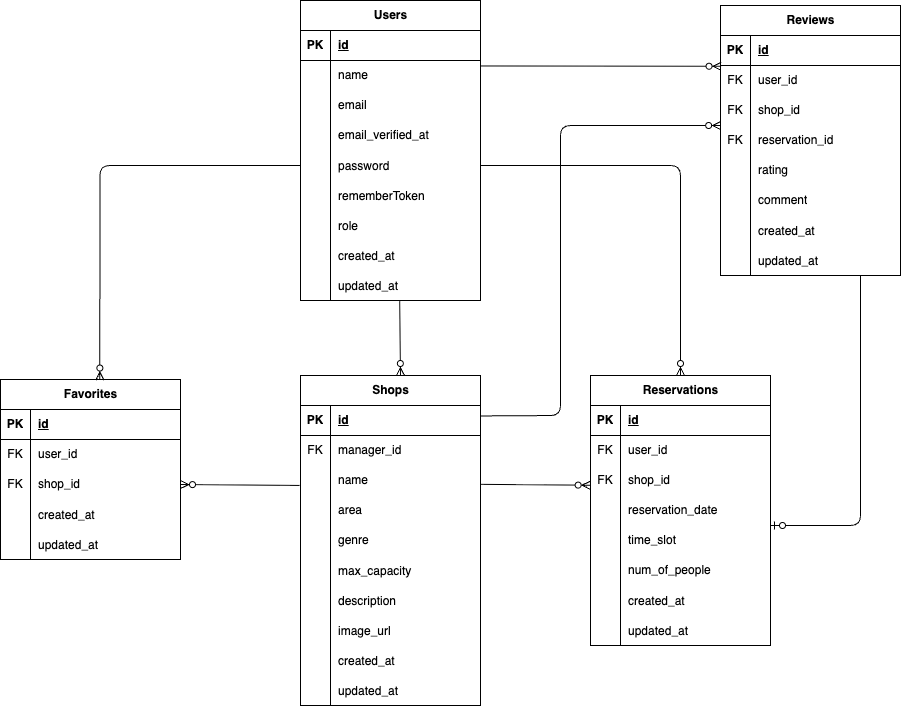

# アプリケーション名

Rese（リーズ）<br>
飲食店予約サービスアプリです。

## 作成した目的

外部予約サービスは手数料が発生するため、自社で予約サービスを所有することを目的としています。

## 機能一覧

- 会員登録機能
- ログイン機能
- メール認証機能
- 店舗検索機能
- お気に入り機能
- 店舗予約/予約変更/予約キャンセル機能
- QR コード機能
- 店舗の評価機能
- 店舗代表者作成機能（管理者）
- 店舗情報作成/更新機能（店舗代表者）

## 使用技術（実行環境）

- PHP 8.4.6
- Laravel 8.83.8
- mysql 9.3.0
- nginx 1.29.3
- MailHog latest
- simple-qrcode

## 環境構築

1. `git clone https://github.com/pokimaru3/TokajiSuzuka_test3.git`
2. DockerDesktop アプリを立ち上げる
3. `docker-compose up -d --build`
   > _Mac の M1・M2 チップの PC の場合、`no matching manifest for linux/arm64/v8 in the manifest list entries`のメッセージが表示されビルドができないことがあります。
   > エラーが発生する場合は、docker-compose.yml ファイルの「mysql」内に「platform」の項目を追加で記載してください_

```bash
mysql:
    platform: linux/x86_64(この文追加)
    image: mysql:8.0.26
    environment:
```

> mysql コンテナが動かない場合以下のコマンドを実行してください。

1. `docker compose down -v`
2. `sudo rm -rf ./docker/mysql/data`
3. `docker system prune -f`
4. `docker compose up -d --build`

**Laravel 環境構築**

1. `docker-compose exec php bash`
2. `composer install`
3. 「.env.example」ファイルを 「.env」ファイルに命名を変更。または、新しく.env ファイルを作成
4. .env に以下の環境変数を追加

```text
DB_CONNECTION=mysql
DB_HOST=mysql
DB_PORT=3306
DB_DATABASE=laravel_db
DB_USERNAME=laravel_user
DB_PASSWORD=laravel_pass

MAIL_MAILER=smtp
MAIL_HOST=mailhog
MAIL_PORT=1025
MAIL_USERNAME=null
MAIL_PASSWORD=null
MAIL_ENCRYPTION=null
MAIL_FROM_ADDRESS=example@example.com
MAIL_FROM_NAME="${APP_NAME}"
```

5. アプリケーションキーの作成

```bash
php artisan key:generate
```

6. マイグレーションの実行

```bash
php artisan migrate
```

7. シーディングの実行

```bash
php artisan db:seed
```

#### mailhog

http://localhost:8025

#### QR コード

ngrok を利用してローカル環境を一時的に公開しています。
リポジトリをクローンした後、各自で ngrok を起動し、
発行された URL を .env の NGROK_URL に設定することで動作確認が可能です。

1.ngrok にサインアップ
https://ngrok.com/

2.ngrok をインストール

```bash
brew install ngrok
```

3.ngrok を起動

```bash
ngrok http 80
```

4.表示された URL を .env に設定<br>
NGROK_URL=https://xxxxx.ngrok-free.dev

```bash
php artisan config:clear
```

QR 読み取り後、visit site をクリックすると予約内容が表示されます。

## テストユーザー

|              | ユーザー名 | メールアドレス                                      | パスワード |
| ------------ | ---------- | --------------------------------------------------- | ---------- |
| 管理者       | Admin      | [admin@example.com](mailto:admin@example.com)       | password   |
| 店舗代表者   | Manager1   | [manager1@example.com](mailto:manager1@example.com) | password   |
| 店舗代表者   | Manager2   | [manager2@example.com](mailto:manager2@example.com) | password   |
| 一般ユーザー | User1      | [user@example.com](mailto:user@example.com)         | password   |
| 一般ユーザー | User2      | [user2@example.com](mailto:user2@example.com)       | password   |

## テーブル設計

### users テーブル

| カラム名          | 型                             | primary key | unique key | not null | foreign key |
| ----------------- | ------------------------------ | ----------- | ---------- | -------- | ----------- |
| id                | unsigned bigint                | ○           |            | ○        |             |
| name              | varchar(50)                    |             |            | ○        |             |
| email             | varchar(255)                   |             | ○          | ○        |             |
| email_verified_at | timestamp                      |             |            | ○        |             |
| password          | varchar(255)                   |             |            | ○        |             |
| rememberToken     | varchar(100)                   |             |            |          |             |
| role              | enum('user','manager','admin') |             |            | ○        |             |
| created_at        | timestamp                      |             |            |          |             |
| updated_at        | timestamp                      |             |            |          |             |

### shops テーブル

| カラム名     | 型              | primary key | unique key | not null | foreign key |
| ------------ | --------------- | ----------- | ---------- | -------- | ----------- |
| id           | unsigned bigint | ○           |            | ○        |             |
| manager_id   | unsigned bigint |             |            |          | users(id)   |
| name         | varchar(100)    |             |            | ○        |             |
| area         | varchar(50)     |             |            | ○        |             |
| genre        | varchar(50)     |             |            | ○        |             |
| max_capacity | integer         |             |            | ○        |             |
| description  | text            |             |            | ○        |             |
| image_url    | varchar(255)    |             |            |          |             |
| created_at   | timestamp       |             |            |          |             |
| updated_at   | timestamp       |             |            |          |             |

### favorite テーブル

| カラム名   | 型              | primary key | unique key | not null | foreign key |
| ---------- | --------------- | ----------- | ---------- | -------- | ----------- |
| id         | unsigned bigint | ○           |            | ○        |             |
| user_id    | unsigned bigint |             |            | ○        | users(id)   |
| shop_id    | unsigned bigint |             |            | ○        | shops(id)   |
| created_at | timestamp       |             |            |          |             |
| updated_at | timestamp       |             |            |          |             |

### reservation テーブル

| カラム名         | 型              | primary key | unique key | not null | foreign key |
| ---------------- | --------------- | ----------- | ---------- | -------- | ----------- |
| id               | unsigned bigint | ○           |            | ○        |             |
| user_id          | unsigned bigint |             |            | ○        | users(id)   |
| shop_id          | unsigned bigint |             |            | ○        | shops(id)   |
| reservation_date | date            |             |            | ○        |             |
| time_slot        | time            |             |            | ○        |             |
| num_of_people    | integer         |             |            | ○        |             |
| created_at       | timestamp       |             |            |          |             |
| updated_at       | timestamp       |             |            |          |             |

### reviews テーブル

| カラム名       | 型              | primary key | unique key | not null | foreign key      |
| -------------- | --------------- | ----------- | ---------- | -------- | ---------------- |
| id             | unsigned bigint | ○           |            | ○        |                  |
| reservation_id | unsigned bigint |             |            | ○        | reservations(id) |
| user_id        | unsigned bigint |             |            | ○        | users(id)        |
| shop_id        | unsigned bigint |             |            | ○        | shops(id)        |
| rating         | tinyint         |             |            | ○        |                  |
| comment        | text            |             |            |          |                  |
| created_at     | timestamp       |             |            |          |                  |
| updated_at     | timestamp       |             |            |          |                  |

## ER 図



# 備考

- 飲食店の検索機能は検索ボタンがないので Enter を押すと検索結果が表示されます。

コーチの許可あり ↓

- 会員登録後の thanks ページのログインするを押すと、shop_all ページに遷移する
- mypage の予約は予約日を過ぎると予約状況から消える
- 過去の予約は来店履歴として表示され、そこから店舗の評価をすることもできます
- 店舗代表者の店舗一覧のメールアイコンを押すとお知らせメールの送信ページを開くことができる（送信したメールはmailhogで確認できます）

```
・from address 店舗のメールアドレス
・to address users.email
送信先はその店舗を予約したことがあるユーザーをセレクトボックスで選択できるようにしています。
```

- QRコードはmypageの予約カードの中にQRコードを表示するボタンを作っています
- 店舗作成時に最大予約可能人数を設定できるようにshops tableのmax_capacityを追加しています。

## PHPUnit のテストについて

```
//テスト用データベースの作成
docker-compose exec mysql bash
mysql -u root -p
//パスワードはrootと入力
create database test_database;
```

#### config ディレクトリの中の database.php を開き、mysql の配列部分をコピーして以下に新たに mysql_test を作成

以下の項目を編集

- 'database' => 'test_database'
- 'username' => 'root'
- 'password' => 'root'

#### テスト用の.env ファイル作成

```
cp .env .env.testing
```

#### .env.testing ファイルの APP_ENV と APP_KEY を編集

- APP_NAME=Laravel
- APP_ENV=test
- APP_KEY=
- APP_DEBUG=true
- APP_URL=http://localhost

#### .env.testing ファイルの DB_DATABASE,DB_USERNAME,DB_PASSWORD を編集

- DB_CONNECTION=mysql_test
- DB_HOST=mysql
- DB_PORT=3306
- DB_DATABASE=test_database
- DB_USERNAME=root
- DB_PASSWORD=root

#### アプリケーションキーを作成

```
php artisan key:generate --env=testing
```

#### マイグレーション

```
php artisan migrate --env=testing
```

#### PHPUnit の設定

テストを専用データベースで実行するため、`phpunit.xml` を編集してください。

```diff
- <!-- <server name="DB_CONNECTION" value="sqlite"/> -->
- <!-- <server name="DB_DATABASE" value=":memory:"/> -->
+ <server name="DB_CONNECTION" value="mysql_test"/>
+ <server name="DB_DATABASE" value="test_database"/>
```

#### テストの実行

```
php artisan test
```
